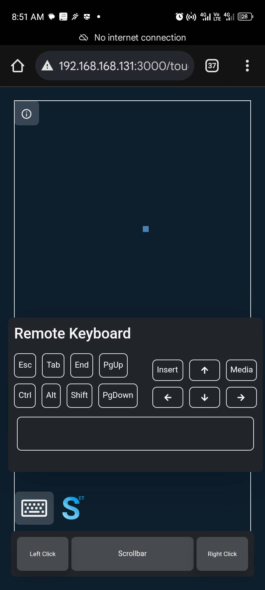

# FSdiscover - Access your PC via mobile phone

## Overview

**FSdiscover** is a cross-platform remote control and monitoring tool that lets users operate their computer from a mobile phone or another device over a network. I built this project as part of my exploration into remote system control and user accessibility. It solves the problem of physical inaccessibility by enabling real-time mouse and keyboard control, remote typing with a virtual keypad, and lightweight system monitoring. Ideal for developers, sysadmins, or anyone needing hands-on control of their desktop from anywhere—without relying on heavy remote desktop software.

FSdiscover is cross-platform and works on Linux, Windows, and macOS. It integrates smoothly into your desktop environment and is accessible via a simple command-line interface or desktop launcher.

---

## 📸 Preview




## Features

- **Remote Input Control**: Send real-time mouse and keyboard inputs from one device to another.
- **Virtual Keypad**: Type remotely using an on-screen keyboard.
- **Live NetProbe Monitoring**: Monitor network activity and system status with updated, bug-fixed tools.
- **Interactive Tour Guide**: Quickly get familiar with all features through a built-in guide.
- **Touchpad State Indicator**: Check the status of your touchpad at a glance.
- **Device Management Dashboard**: Manage all connected and authorized devices from a centralized admin interface.
- **Cross-Platform**: Available for Linux, Windows, and macOS.
- **CLI & Desktop Integration**: Launch via `fsdiscover` in the terminal or through a graphical launcher.

---

## Installation

### Linux and macOS

```bash
git clone https://github.com/msugh623/fsdiscover.git
cd fsdiscover
./install.sh
```

### Windows

```cmd
git clone https://github.com/msugh623/fsdiscover.git
cd fsdiscover
install.cmd
```

---

## Usage

To start FSdiscover:

```bash
fsdiscover
```

To uninstall FSdiscover:

```bash
fsdiscover -u
# or
fsdiscover --uninstall
```

To view available options:

```bash
fsdiscover -h
# or
fsdiscover --help
```

---
